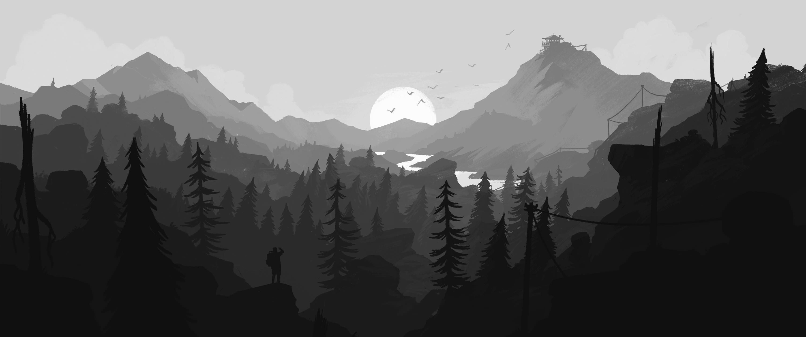
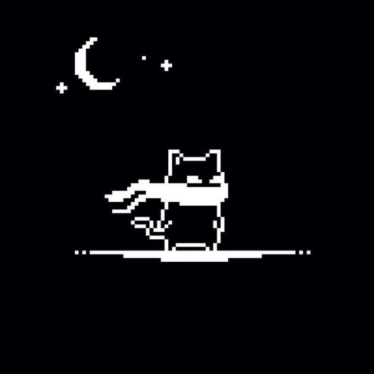

<h1 align="center">Wilhelm Schwartz</h1>

Hi! My name is Wilhelm. I'm a Rust developer. My main specialization is network programming and working with network infrastructure. I'm also actively learning Linux-based operating systems, but I use NixOs for everyday tasks and work.

> "I'm a strong advocate for **Free Software**. I believe in open collaboration and encourage the use, study, and modification of my work for the benefit of the community."

<code>[wilhelm@nixos:~]$ nix-shell -p rustc</code>&nbsp;&nbsp;&nbsp;&nbsp;&nbsp;&nbsp;

  <!-- Этот тег сбросит обтекание картинки, чтобы заголовок не "уехал" вверх -->
 

  <h1>Technologies</h1>

 

